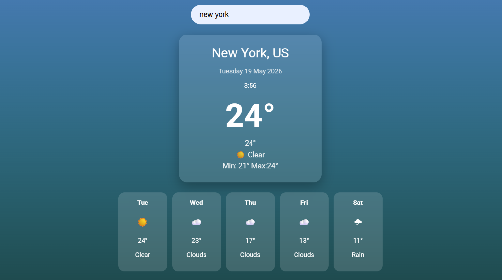

Weather Forecast Web Application

Description

It helps users quickly check the current weather and see a 5-day forecast, so you can plan your day or week accordingly without opening multiple sites or apps.

The application provides clear and user-friendly input for:

- City name

After entering a city and pressing Enter, the application instantly displays:

- Current temperature
- “Feels like” temperature
- Weather conditions (e.g., Sunny, Rainy, Snowy)
- Minimum and maximum temperatures for the day
- 5-day forecast with daily highs, lows, and weather conditions

Optional enhancements include dynamic backgrounds and icons that change according to the weather, providing a more engaging visual experience.

Live Demo:

https://skycastlyweathora.netlify.app/ 

Screenshot

 

Technologies Used

- JavaScript
- HTML
- CSS
- OpenWeatherMap API (for weather data)

How to Run the Project

No additional setup is required.

1. Clone the repository:
 bash 
git clone https://github.com/ktrn-s/weather-app

2. Open the project folder and open `index.html` in your browser.

Challenges and Learnings

This project helped strengthen my understanding of:

- Working with APIs and asynchronous JavaScript (fetch, async/await)
- Handling JSON data from real-world APIs
- DOM manipulation and dynamic UI updates
- Creating responsive and interactive user interfaces

A key challenge was correctly parsing the 5-day forecast data and displaying it in a clean format.

Future Improvements

- Hourly forecast view
- City autocomplete search
- Animated weather icons
- Improved mobile responsiveness
- Geolocation-based weather detection
