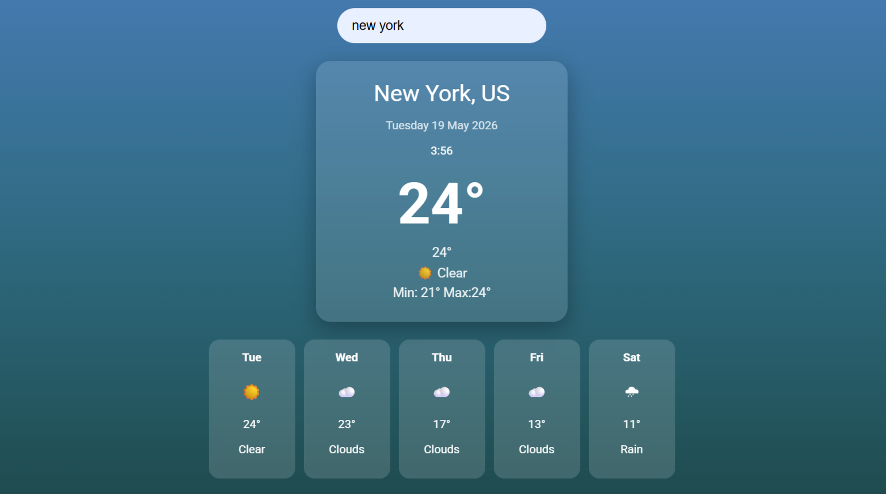

# SkyCast ☀️
### Responsive Weather Forecast Web Application
Description

SkyCast is a responsive weather forecast application that allows users to search for any city and view current weather conditions along with a 5-day forecast. The application uses the OpenWeatherMap API to retrieve real-time weather data and presents it through a clean, modern interface with dynamic backgrounds and subtle animations.

The application allows users to search for weather information by entering a city name.

## Features

After entering a city and pressing Enter, the application instantly displays:

- Current temperature
- "Feels like" temperature
- Weather conditions (e.g., Sunny, Rainy, Snowy)
- Daily minimum and maximum temperatures
- 5-day weather forecast
- GSAP-powered animations

Additional features include dynamic backgrounds and weather icons that change according to the current weather conditions, creating a more engaging user experience.

## Live Demo

https://skycastlyweathora.netlify.app/ 

## Screenshot

 

## Technologies Used

- HTML
- CSS
- JavaScript
- GSAP
- OpenWeatherMap API (for weather data)


## How to Run the Project

No additional setup is required.

1. Clone the repository:
 ```bash 
git clone https://github.com/ktrn-s/weather-app
```

2. Open the project folder and open `index.html` in your browser.

## Challenges and Learnings

This project helped strengthen my understanding of:

- Working with APIs and asynchronous JavaScript (fetch, async/await)
- Handling JSON data from real-world APIs
- DOM manipulation and dynamic UI updates
- Creating responsive and interactive user interfaces
- Adding animations using GSAP

One of the main challenges was working with the OpenWeatherMap forecast endpoint, which returns weather data in 3-hour intervals. I implemented logic to extract representative daily forecasts and display them in a clear, user-friendly format.

Future Improvements

- Hourly forecast view
- City autocomplete search
- Animated weather icons
- Additional weather information (humidity, wind speed, pressure)
- Improved mobile responsiveness
- Geolocation-based weather detection
- Sunrise and sunset times


